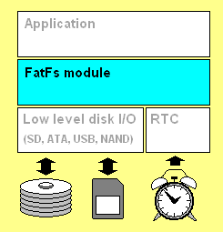

FatFs - Generic FAT File System Module
======================================

FatFs is a generic FAT file system module for small embedded systems.
The FatFs is written in compliance with ANSI C and completely separated
from the disk I/O layer. Therefore it is independent of hardware
architecture. It can be incorporated into small microcontrollers with
limited resource, such as AVR, 8051, PIC, ARM, Z80, 68k and etc. Also
Petit FatFs module for tiny microcontrollers is available
[here](http://elm-chan.org/fsw/ff/00index_p.html).

**Features**

  - Windows compatible FAT file system.
  - Platform independent. Easy to port.
  - Very small footprint for code and work area.
  - Various configuration options:
      - Multiple volumes (physical drives and partitions).
      - Multiple ANSI/OEM code pages including DBCS.
      - Long file name support in ANSI/OEM or Unicode.
      - RTOS support.
      - Multiple sector size support.
      - Read-only, minimized API, I/O buffer and etc...

Application Interface
---------------------

FatFs module provides following functions to the applications. In other
words, this list describes what FatFs can do to access the FAT volumes.

  - [f\_mount](en/mount.md) - Register/Unregister a work area
  - [f\_open](en/open.md) - Open/Create a file
  - [f\_close](en/close.md) - Close an open file
  - [f\_read](en/read.md) - Read file
  - [f\_write](en/write.md) - Write file
  - [f\_lseek](en/lseek.md) - Move read/write pointer, Expand file
    size
  - [f\_truncate](en/truncate.md) - Truncate file size
  - [f\_sync](en/sync.md) - Flush cached data
  - [f\_forward](en/forward.md) - Forward file data to the stream
  - [f\_stat](en/stat.md) - Check existance of a file or sub-directory
  - [f\_opendir](en/opendir.md) - Open a directory
  - [f\_closedir](en/closedir.md) - Close an open directory
  - [f\_readdir](en/readdir.md) - Read a directory item
  - [f\_mkdir](en/mkdir.md) - Create a sub-directory
  - [f\_unlink](en/unlink.md) - Remove a file or sub-directory
  - [f\_chmod](en/chmod.md) - Change attribute
  - [f\_utime](en/utmdmd) - Change timestamp
  - [f\_rename](en/rename.md) - Rename/Move a file or sub-directory
  - [f\_chdir](en/chdir.md) - Change current directory
  - [f\_chdrive](en/chdrive.md) - Change current drive
  - [f\_getcwd](en/getcwd.md) - Retrieve the current directory
  - [f\_getfree](en/getfree.md) - Get free space on the volume
  - [f\_getlabel](en/getlabel.md) - Get volume label
  - [f\_setlabel](en/setlabel.md) - Set volume label
  - [f\_mkfs](en/mkfs.md) - Create a file system on the drive
  - [f\_fdisk](en/fdisk.md) - Divide a physical drive
  - [f\_gets](en/gets.md) - Read a string
  - [f\_putc](en/putc.md) - Write a character
  - [f\_puts](en/puts.md) - Write a string
  - [f\_printf](en/printf.md) - Write a formatted string
  - [f\_tell](en/tell.md) - Get current read/write pointer
  - [f\_eof](en/eof.md) - Test for end-of-file on a file
  - [f\_size](en/size.md) - Get size of a file
  - [f\_error](en/error.md) - Test for an error on a file

Device Control Interface
------------------------

Since the FatFs module is a file system driver, it is completely
separated from physical devices, such as memory card, harddisk and any
type of storage devices. The low level device control module is not a
part of FatFs module. FatFs accesses the storage device via a simple
interface described below. These functions are provided by implementer.
Sample implementations for some platforms are also available in the
downloads.

  - [disk\_status](en/dstat.md) - Get device status
  - [disk\_initialize](en/dinit.md) - Initialize device
  - [disk\_read](en/dread.md) - Read sector(s)
  - [disk\_write](en/dwrite.md) - Write sector(s)
  - [disk\_ioctl](en/dioctl.md) - Control device dependent features
  - [get\_fattime](en/fattime.md) - Get current time

Resources
---------

The FatFs module is a free software opened for education, research and
development. You can use, modify and/or redistribute it for personal
projects or commercial products without any restriction under your
responsibility. For further information, refer to the application note.

  - [*FatFs User Forum*](http://elm-chan.org/fsw/ff/bd/)↗
  - Read first: [FatFs module application note](en/appnote.md)
  - Latest Information: <http://elm-chan.org/fsw/ff/00index_e.html>↗
  - [Nemuisan's Blog](http://nemuisan.blog.bai.ne.jp/)↗ (Well written
    implementations for STM32F/SDIO and LPC2300/MCI)
  - [ARM-Projects by Martin
    THOMAS](http://www.siwawi.arubi.uni-kl.de/avr_projects/arm_projects/arm_memcards/index.html)↗
    (Examples for LPC2000, AT91SAM and STM32)
  - [FAT32 Specification by
    Microsoft](http://www.microsoft.com/whdc/system/platform/firmware/fatgen.mspx)↗
    (The reference document on FAT file system)
  - [The basics of FAT file system
    \[ja\]](http://elm-chan.org/docs/fat.html)↗
  - [How to Use MMC/SDC](http://elm-chan.org/docs/mmc/mmc_e.html)↗
  - [Benchmark 1](img/rwtest.png) (ATmega64/9.2MHz with MMC via SPI,
    HDD/CFC via GPIO)
  - [Benchmark 2](img/rwtest2.png) (LPC2368/72MHz with MMC via MCI)
  - [Demo movie of an
    application](http://members.jcom.home.ne.jp/felm/fd.mp4) (this
    project is in ffsample.zip/lpc23xx)
