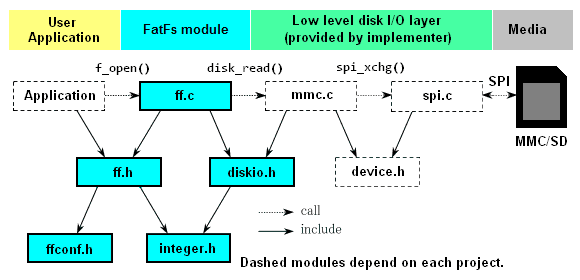
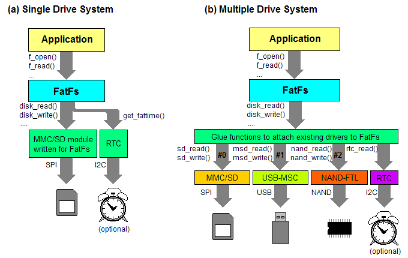
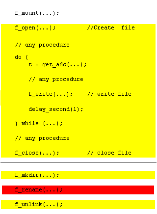
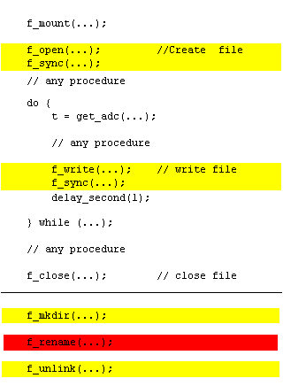

# FatFs Module Application Note

1.  [How to Port](#port)
2.  [Limits](#limits)
3.  [Memory Usage](#memory)
4.  [Module Size Reduction](#reduce)
5.  [Long File Name](#lfn)
6.  [Unicode API](#unicode)
7.  [Re-entrancy](#reentrant)
8.  [Duplicated File Access](#dup)
9.  [Performance Effective File Access](#fs1)
10. [Considerations on Flash Memory Media](#fs2)
11. [Critical Section](#critical)
12. [Extended Use of FatFs API](#fs3)
13. [About FatFs License](#license)

-----

### How to Port

#### Basic considerations

The FatFs module is assuming following conditions on portability.

  - ANSI C  
    The FatFs module is a middleware written in ANSI C (C89). There is
    no platform dependence, so long as the compiler is in compliance
    with ANSI C.
  - Size of integer types  
    The FatFs module assumes that size of char/short/long are 8/16/32
    bit and int is 16 or 32 bit. These correspondence are defined in
    `integer.h`. This will not be a problem on most compilers. When any
    conflict with existing definitions is occured, you must resolve it
    with care.

#### System organizations

The dependency diagram shown below is a typical configuration of the
embedded system with FatFs module.

(a) If a working disk module with FatFs API is provided, no additional
function is needed. (b) To attach existing disk drivers with different
API, glue functions are needed to translate the APIs between FatFs and
the drivers.

### Limits

  - FAT sub-types: FAT12, FAT16 and FAT32.
  - Number of open files: Unlimited, depends on available memory.
  - Number of volumes: Upto 10.
  - File size: Depends on the FAT specs. (upto 4G-1 bytes)
  - Volume size: Depends on the FAT specs. (upto 2T bytes at 512 bytes/sector)
  - Cluster size: Depends on the FAT specs. (upto 64K bytes at 512 bytes/sector)
  - Sector size: Depends on the FAT specs. (512, 1024, 2048 and 4096 bytes)

### Long File Name

FatFs module supports LFN (long file name). The two different file
names, SFN (short file name) and LFN, of a file is transparent on the
API except for `f_readdir()` function. The LFN feature is disabled by
default. To enable it, set `_USE_LFN` to 1, 2 or 3, and add
`option/unicode.c` to the project. The LFN feature requiers a certain
working buffer in addition. The buffer size can be configured by
`_MAX_LFN` according to the available memory. The length of an LFN will
reach up to 255 characters, so that the `_MAX_LFN` should be set to 255
for full featured LFN operation. If the size of working buffer is
insufficient for the input file name, the file function fails with
`FR_INVALID_NAME`. When enable the LFN feature with re-entrant
configuration, `_USE_LFN` must be set to 2 or 3. In this case, the file
function allocates the working buffer on the stack or heap. The working
buffer occupies `(_MAX_LFN + 1) * 2` bytes.

| Code page      | Program size |
| -------------- | ------------ |
| SBCS           | \+3.7K       |
| 932(Shift-JIS) | \+62K        |
| 936(GBK)       | \+177K       |
| 949(Korean)    | \+139K       |
| 950(Big5)      | \+111K       |

LFN cfg on ARM7TDMI

When the LFN feature is enabled, the module size will be increased
depends on the selected code page. Right table shows how many bytes
increased when LFN feature is enabled with some code pages. Especially,
in the CJK region, tens of thousands of characters are being used.
Unfortunately, it requires a huge OEM-Unicode bidirectional conversion
table and the module size will be drastically increased that shown in
the table. As the result, the FatFs with LFN feature with those code
pages will not able to be implemented to most 8-bit microcontrollers.

Note that the LFN feature on the FAT file system is a patent of
Microsoft Corporation. This is not the case on FAT32 but most FAT32
drivers come with the LFN feature. FatFs can swich the LFN feature off
by configuration option. When enable LFN feature on the commercial
products, a license from Microsoft may be required depends on the final
destination.

### Unicode API

By default, FatFs uses ANSI/OEM code set on the API under LFN
configuration. FatFs can also switch the character encoding to Unicode
on the API by `_LFN_UNICODE` option. This means that the FatFs supports
the True-LFN feature. For more information, refer to the description in
the [file name](filename.md).

### Re-entrancy

The file operations to the different volume is always re-entrant and can
work simultaneously. The file operations to the same volume is not
re-entrant but it can also be configured to thread-safe by
`_FS_REENTRANT` option. In this case, also the OS dependent
synchronization object control functions, `ff_cre_syncobj(),
ff_del_syncobj(), ff_req_grant() and ff_rel_grant()` must be added to
the project. There are some examples in the `option/syscall.c`.

When a file function is called while the volume is in use by any other
task, the file function is suspended until that task leaves the file
function. If wait time exceeded a period defined by `_TIMEOUT`, the file
function will abort with `FR_TIMEOUT`. The timeout feature might not be
supported by some RTOS.

There is an exception for `f_mount(), f_mkfs(), f_fdisk()` function.
These functions are not re-entrant to the same volume or corresponding
physical drive. When use these functions, all other tasks must unmount
he volume and avoid to access the volume.

Note that this section describes on the re-entrancy of the FatFs module
itself but also the low level disk I/O layer will need to be re-entrant.

### Duplicated File Access

FatFs module does not support the read/write collision control of
duplicated open to a file. The duplicated open is permitted only when
each of open method to a file is read mode. The duplicated open with one
or more write mode to a file is always prohibited, and also open file
must not be renamed and deleted. A violation of these rules can cause
data colluption.

The file lock control can be enabled by `_FS_LOCK` option. The value of
option defines the number of open objects to manage simultaneously. In
this case, if any open, rename or remove that violating the file
shareing rule that described above is attempted, the file function will
fail with `FR_LOCKED`. If number of open objects, files and
sub-directories, is equal to `_FS_LOCK`, an extra `f_open(),
f_optndir()` function will fail with `FR_TOO_MANY_OPEN_FILES`.

### Performance Effective File Access

For good read/write throughput on the small embedded systems with
limited size of memory, application programmer should consider what
process is done in the FatFs module. The file data on the volume is
transferred in following sequence by `f_read()` function.

Figure 1. Sector misaligned read (short)  

Figure 2. Sector misaligned read (long)  

Figure 3. Fully sector aligned read  

The file I/O buffer is a sector buffer to read/write a partial data on
the sector. The sector buffer is either file private sector buffer on
each file object or shared sector buffer in the file system object. The
buffer configuration option `_FS_TINY` determins which sector buffer is
used for the file data transfer. When tiny buffer configuration (1) is
selected, data memory consumption is reduced `_MAX_SS` bytes each file
object. In this case, FatFs module uses only a sector buffer in the file
system object for file data transfer and FAT/directory access. The
disadvantage of the tiny buffer configuration is: the FAT data cached in
the sector buffer will be lost by file data transfer and it must be
reloaded at every cluster boundary. However it will be suitable for most
application from view point of the decent performance and low memory
comsumption.

Figure 1 shows that a partial sector, sector misaligned part of the
file, is transferred via the file I/O buffer. At long data transfer
shown in Figure 2, middle of transfer data that covers one or more
sector is transferred to the application buffer directly. Figure 3 shows
that the case of entier transfer data is aligned to the sector boundary.
In this case, file I/O buffer is not used. On the direct transfer, the
maximum extent of sectors are read with `disk_read()` function at a time
but the multiple sector transfer is divided at cluster boundary even if
it is contiguous.

Therefore taking effort to sector aligned read/write accesss eliminates
buffered data transfer and the read/write performance will be improved.
Besides the effect, cached FAT data will not be flushed by file data
transfer at the tiny configuration, so that it can achieve same
performance as non-tiny configuration with small memory footprint.

### Considerations on Flash Memory Media

To maximize the write performance of flash memory media, such as SDC,
CFC and U Disk, it must be controlled in consideration of its
characteristitcs.

#### Using Mutiple-Sector Write

Figure 6. Comparison between Multiple/Single Sector Write  

The write throughput of the flash memory media becomes the worst at
single sector write transaction. The write throughput increases as the
number of sectors per a write transaction. This effect more appers at
faster interface speed and the performance ratio often becomes grater
than ten. [This graph](../img/rwtest2.png) is clearly explaining how
fast is multiple block write (W:16K, 32 sectors) than single block write
(W:100, 1 sector), and also larger card tends to be slow at single block
write. The number of write transactions also affects the life time of
the flash memory media. Therefore the application program should write
the data in large block as possible. The ideal write chunk size and
alighment is size of sector, and size of cluster is the best. Of course
all layers between the application and the storage device must have
consideration on multiple sector write, however most of open-source disk
drivers lack it. Do not split a multiple sector write request into
single sector write transactions or the write throughput gets poor. Note
that FatFs module and its sample disk drivers supprt multiple sector
read/write feature.

#### Forcing Memory Erase

When remove a file with `f_remove()` function, the data clusters
occupied by the file are marked 'free' on the FAT. But the data sectors
containing the file data are not that applied any process, so that the
file data left occupies a part of the flash memory array as 'live
block'. If the file data is forced erased on removing the file, those
data blocks will be turned in to the free block pool. This may skip
internal block erase operation to the data block on next write
operation. As the result the write performance might be improved. FatFs
can manage this feature by setting `_USE_ERASE` to 1. Note that this is
an expectation of internal process of the flash memory storage and not
that always effective. Also `f_remove()` function will take a time when
remove a large file. Most applications will not need this feature.

### Critical Section

If a write operation to the FAT volume is interrupted due to any
accidental failure, such as sudden blackout, incorrect disk removal and
unrecoverable disk error, the FAT structure on the volume can be broken.
Following images shows the critical section of the FatFs module.

**Figure 4. Long critical section**

**Figure 5. Minimized critical section**

An interruption in the red section can cause a cross link; as a result,
the object being changed can be lost. If an interruption in the yellow
section is occured, there is one or more possibility listed below.

  - The file data being rewrited is collapsed.
  - The file being appended returns initial state.
  - The file created as new is gone.
  - The file created as new or overwritten remains but no content.
  - Efficiency of disk use gets worse due to lost clusters.

Each case does not affect the files that not opened in write mode. To
minimize risk of data loss, the critical section can be minimized by
minimizing the time that file is opened in write mode or using
`f_sync()` function as shown in Figure 5.

### Extended Use of FatFs API

These are examples of extended use of FatFs APIs. New item will be added
whenever a useful code is found.

1.  [Open or create a file for append](../img/app1.c)
2.  [Empty a directory](../img/app2.c)
3.  [Allocate contiguous area to the file](../img/app3.c)
4.  [Function/Compatible checker for low level disk I/O module](../img/app4.c)
